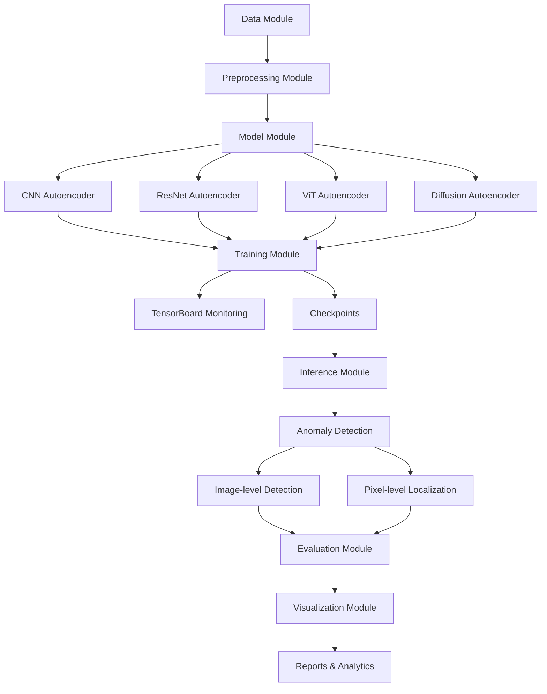
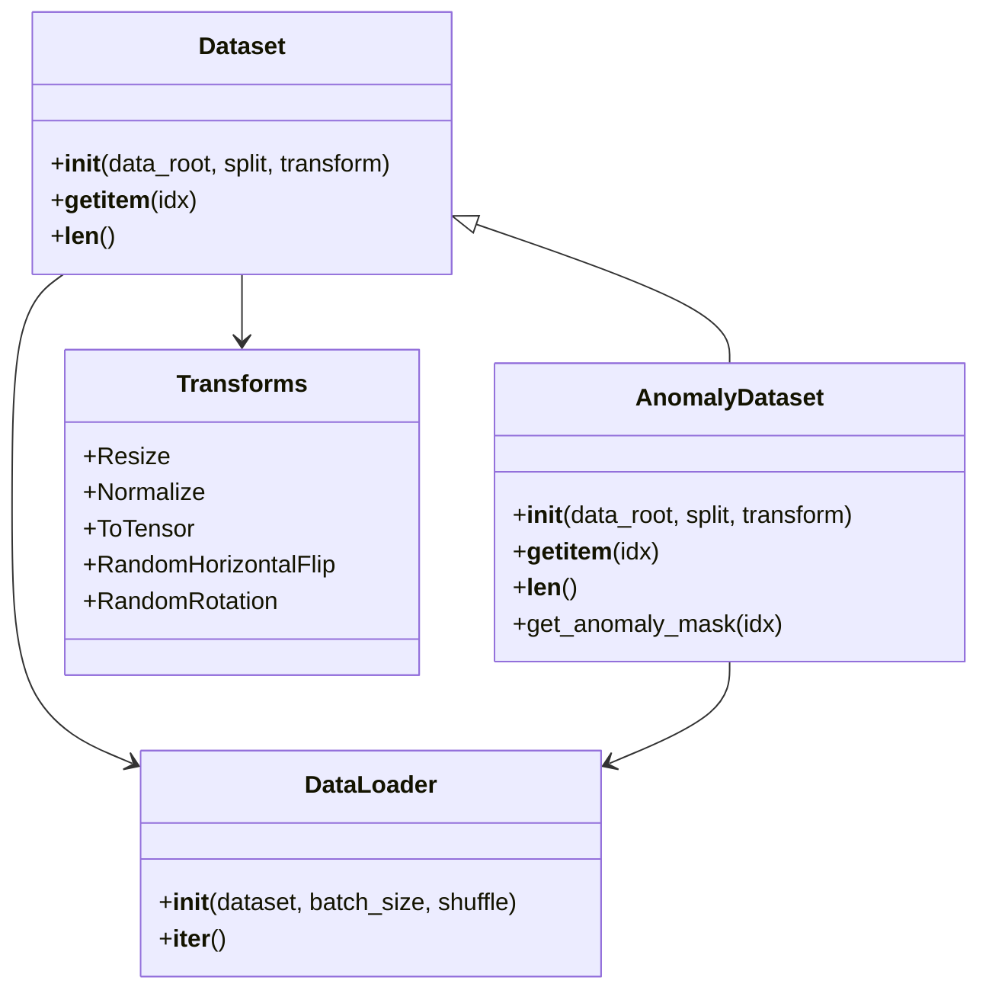
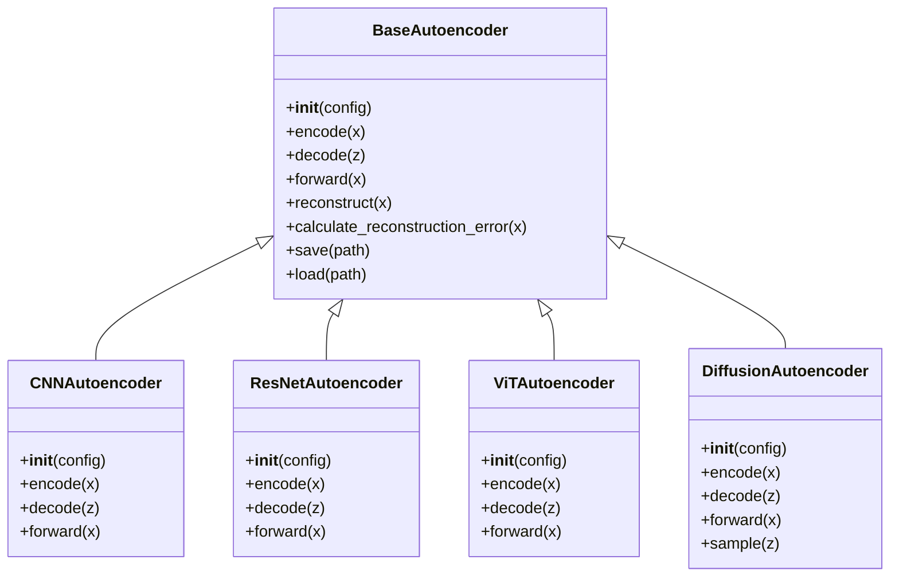
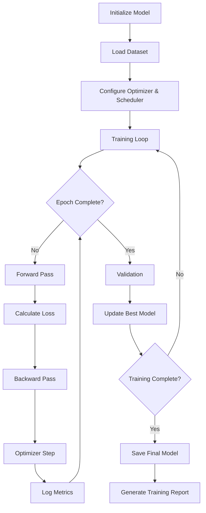
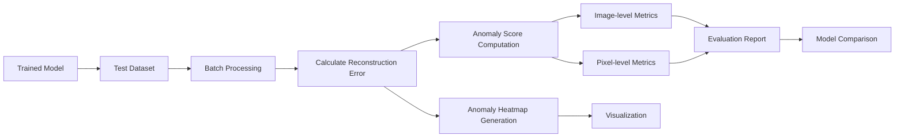

# Comprehensive Autoencoder-Based Anomaly Detection System - Implementation Plan

## 1. Project Overview

This document outlines the detailed implementation plan for a sophisticated image anomaly detection system using multiple autoencoder architectures implemented in PyTorch. The system will process images from the MVTec dataset (zipper category) and identify anomalies through reconstruction error analysis.

The key objectives of this project are:
- Implement four distinct autoencoder variants for anomaly detection
- Create a modular, maintainable codebase with separate scripts for training and inference
- Implement comprehensive training monitoring using TensorBoard
- Provide detailed analytics on detected anomalies through visualization tools
- Compare performance across different architectures using appropriate metrics

## 2. System Architecture



## 3. Project Structure

```
anomaly_detection/
│
├── environment.yml                  # Conda environment specification
├── setup.py                         # Package installation script
├── README.md                        # Project documentation
│
├── config/                          # Configuration files
│   ├── default.yaml                 # Default configuration
│   ├── models/                      # Model-specific configurations
│   └── experiments/                 # Experiment configurations
│
├── data/                            # Data handling
│   ├── __init__.py
│   ├── dataset.py                   # Dataset classes
│   ├── preprocessing.py             # Image preprocessing functions
│   └── augmentation.py              # Data augmentation functions
│
├── models/                          # Model architectures
│   ├── __init__.py
│   ├── base.py                      # Base model class
│   ├── cnn_ae.py                    # CNN-based autoencoder
│   ├── resnet_ae.py                 # ResNet-based autoencoder
│   ├── vit_ae.py                    # Vision Transformer autoencoder
│   └── diffusion_ae.py              # Diffusion model-based autoencoder
│
├── training/                        # Training pipeline
│   ├── __init__.py
│   ├── trainer.py                   # Training loop implementation
│   ├── optimizer.py                 # Optimizer configurations
│   ├── scheduler.py                 # Learning rate schedulers
│   └── losses.py                    # Loss functions
│
├── inference/                       # Inference pipeline
│   ├── __init__.py
│   ├── detector.py                  # Anomaly detection logic
│   ├── metrics.py                   # Evaluation metrics
│   └── benchmarking.py              # Performance benchmarking
│
├── visualization/                   # Visualization tools
│   ├── __init__.py
│   ├── heatmaps.py                  # Anomaly visualization
│   ├── reconstruction.py            # Reconstruction visualization
│   └── tensorboard.py               # TensorBoard utilities
│
├── utils/                           # Utility functions
│   ├── __init__.py
│   ├── io_utils.py                  # I/O utilities
│   ├── logger.py                    # Logging configuration
│   └── metrics.py                   # Common metrics utilities
│
├── scripts/                         # Executable scripts
│   ├── train.py                     # Training script
│   ├── inference.py                 # Inference script
│   ├── evaluate.py                  # Evaluation script
│   └── visualize.py                 # Visualization script
│
└── notebooks/                       # Jupyter notebooks
    ├── exploratory_analysis.ipynb   # Data exploration
    ├── model_comparison.ipynb       # Model comparison analysis
    └── case_studies.ipynb           # In-depth case studies
```

## 4. Component Details

### 4.1 Data Module



- Implements data loaders for the MVTec dataset
- Handles image preprocessing and augmentation
- Supports training, validation, and test splits
- Provides standardized interfaces for all models

### 4.2 Model Architectures



#### CNN-based Autoencoder
- Simple convolutional architecture with symmetrical encoder-decoder
- Skip connections for better reconstruction quality
- Batch normalization and dropout for regularization

#### ResNet-based Autoencoder
- Encoder using ResNet blocks for feature extraction
- Decoder with transposed convolutions and ResNet blocks
- Deeper representation capabilities while maintaining training stability

#### Vision Transformer (ViT) Autoencoder
- Transformer-based encoder with patch embeddings
- Self-attention mechanisms to capture global context
- Transformer or CNN-based decoder for reconstruction

#### Diffusion Model-based Autoencoder
- Diffusion process for image generation
- Noise prediction network for denoising
- Sampling-based reconstruction

### 4.3 Training Pipeline



- Configurable training pipelines for all models
- AdamW optimizer with cosine annealing scheduler
- Multi-GPU support with DistributedDataParallel
- Early stopping and checkpoint management
- TensorBoard integration for monitoring:
  - Training and validation losses
  - Reconstruction quality metrics
  - Learning rate scheduling
  - Visualizations of reconstructions
  - Anomaly maps on validation examples

### 4.4 Inference and Evaluation



- Fast batch inference for processing multiple images
- Heatmap generation for anomaly localization
- Comprehensive metrics calculation:
  - Image-level: AUROC, F1-score, precision, recall
  - Pixel-level: IoU, DICE coefficient, pixel-wise AUROC
- Runtime performance benchmarking and optimization
- Statistical analysis of results

### 4.5 Visualization and Analytics

- Heatmap overlays for visualizing anomalies
- Side-by-side comparison of original, reconstruction, and error maps
- Interactive dashboard for exploring results
- Statistical analysis of anomaly distributions
- Performance comparison between models
- Export capabilities for reports and presentations

## 5. Implementation Roadmap

### Phase 1: Setup and Data Pipeline (Week 1)
- Set up project structure and environment
- Implement data loading and preprocessing pipeline
- Create data augmentation strategies
- Develop base model architecture and interfaces

### Phase 2: Model Implementation (Weeks 2-3)
- Implement CNN-based autoencoder
- Implement ResNet-based autoencoder
- Implement Vision Transformer autoencoder
- Implement Diffusion model-based autoencoder

### Phase 3: Training Pipeline (Weeks 3-4)
- Develop training loop with monitoring
- Implement loss functions and optimization strategies
- Set up TensorBoard logging
- Test initial training on basic model

### Phase 4: Full-Scale Training (Weeks 4-5)
- Train all models with optimal hyperparameters
- Perform ablation studies
- Fine-tune models based on validation performance
- Generate trained model checkpoints

### Phase 5: Inference and Evaluation (Week 6)
- Implement efficient inference pipeline
- Develop comprehensive evaluation metrics
- Create benchmarking tools
- Analyze performance across models

### Phase 6: Visualization and Reporting (Week 7)
- Implement visualization tools
- Create interactive dashboards
- Generate comparative analysis reports
- Document findings and insights

### Phase 7: Optimization and Finalization (Week 8)
- Optimize models for real-time inference
- Refine documentation
- Package the solution
- Present final results

## 6. Technical Implementation Details

### Environment Setup
- Python 3.8+ environment using Conda
- PyTorch 1.10+ with CUDA support
- Required packages:
  - torch, torchvision, tensorboard
  - numpy, scipy, scikit-learn, pandas
  - matplotlib, seaborn, plotly
  - albumentations, opencv-python
  - tqdm, pyyaml, hydra-core

### Core Model Specifications

#### CNN Autoencoder
- Architecture: Symmetric encoder-decoder with skip connections
- Encoder: 4-5 convolutional blocks with increasing channels (64→128→256→512)
- Decoder: 4-5 transposed convolutional blocks with decreasing channels
- Latent space dimension: 512
- Activation: LeakyReLU, Tanh (output)
- Normalization: Batch normalization
- Regularization: Dropout (0.1-0.3)

#### ResNet Autoencoder
- Encoder: Modified ResNet-18/34 backbone
- Decoder: Upsampling blocks with residual connections
- Latent space dimension: 1024
- Skip connections between corresponding encoder-decoder layers
- Activation: ReLU, Sigmoid (output)
- Normalization: Batch normalization

#### Vision Transformer Autoencoder
- Encoder: ViT with patch size 16x16
- Multi-head self-attention: 8 heads
- Transformer blocks: 6-12 layers
- Embedding dimension: 768
- Decoder: Transformer blocks or CNN-based decoder
- Activation: GELU, Sigmoid (output)
- Normalization: Layer normalization

#### Diffusion Model Autoencoder
- Noise prediction network: U-Net architecture
- Diffusion steps: 50-1000 (configurable)
- Conditioning: Timestep embedding
- Sampling method: DDPM or DDIM for faster inference
- Activation: Swish, Linear (output)
- Normalization: Group normalization

### Training Configuration
- Batch size: 32-64 (adjustable based on model size and GPU memory)
- Optimizer: AdamW (learning rate 1e-4 to 1e-3)
- Learning rate scheduler: CosineAnnealingLR with warm-up
- Loss functions:
  - Reconstruction: MSE, L1, SSIM
  - Perceptual: VGG-based perceptual loss
  - Adversarial: Optional GAN loss for specific architectures
- Training epochs: 100-200 (with early stopping patience 20)
- Gradient clipping: Maximum norm 1.0
- Mixed precision training: Enabled for faster training

### Evaluation Metrics
- Image-level metrics:
  - AUROC (Area Under ROC Curve)
  - AUPRC (Area Under Precision-Recall Curve)
  - F1-score at optimal threshold
  - Precision and recall
- Pixel-level metrics:
  - Per-pixel AUROC
  - Per-region IoU (Intersection over Union)
  - DICE coefficient
  - Precision and recall curves
- Performance metrics:
  - Inference time per image
  - Memory footprint
  - FLOPs analysis

## 7. Real-time Performance Optimization

Given the emphasis on real-time inference capability, special attention will be paid to optimizing the models for efficient execution:

- Model quantization: Converting models to INT8 or mixed precision
- TorchScript compilation for faster inference
- ONNX Runtime integration for cross-platform optimization
- Batch size optimization for inference throughput
- Memory footprint reduction techniques
- CPU vs GPU performance profiling and optimization
- Resource utilization monitoring and bottleneck identification

## 8. Conclusion

This implementation plan provides a comprehensive approach to developing a state-of-the-art anomaly detection system using multiple autoencoder architectures. The modular design ensures extensibility and maintainability, while the focus on evaluation metrics and visualization tools will enable thorough analysis and interpretation of results.

The phased implementation approach allows for incremental development and validation, with a final timeline of approximately 8 weeks to complete the entire system. Regular checkpoints and evaluations will ensure the project stays on track and meets all the specified requirements.