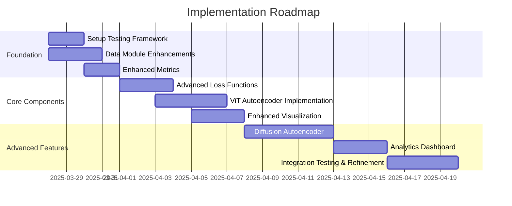
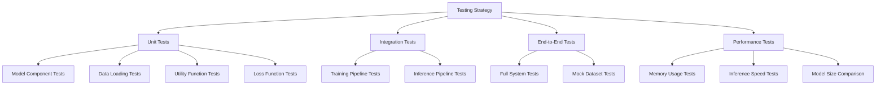

# Autoencoder-Based Anomaly Detection: Implementation Gaps and Completion Plan

## 1. Current Implementation Status and Gaps

```mermaid
graph TD
    A[Implementation Status] --> B[Implemented]
    A --> C[Partially Implemented]
    A --> D[Not Implemented]
    
    B --> B1[Base Model Architecture]
    B --> B2[CNN Autoencoder]
    B --> B3[Basic Dataset Loading]
    B --> B4[Basic Training Pipeline]
    B --> B5[Basic Inference and Visualization]
    B --> B6[Basic Metrics Calculation]
    
    C --> C1[ResNet Autoencoder]
    C --> C2[Configuration System]
    
    D --> D1[Vision Transformer Autoencoder]
    D --> D2[Diffusion Autoencoder]
    D --> D3[Data Preprocessing and Augmentation]
    D --> D4[Advanced Loss Functions]
    D --> D5[Comprehensive Metrics]
    D --> D6[Advanced Visualization]
    D --> D7[Unit Tests]
    D --> D8[Analytics Dashboard]
```



### Key Gaps Analysis:

1. **Model Architectures**:
   - ViT Autoencoder: Configuration exists but implementation is missing
   - Diffusion Autoencoder: Configuration exists but implementation is missing
   - ResNet Autoencoder: Initial implementation exists but needs refinement

2. **Data Pipeline**:
   - Missing data augmentation functionality
   - Preprocessing is basic and needs enhancement
   - No dedicated preprocessing.py file as mentioned in the plan

3. **Training Components**:
   - Limited loss functions (only MSE implemented)
   - Missing advanced training features like learning rate warm-up
   - No perceptual or structural similarity losses

4. **Evaluation and Visualization**:
   - Basic metrics implemented but missing comprehensive metrics
   - Limited visualization capabilities
   - No interactive dashboards or model comparison tools

5. **Testing**:
   - No unit tests for any components
   - No integration tests
   - No test fixtures or mock datasets

## 2. Implementation Plan

The plan is organized by implementation difficulty, focusing on delivering incremental value:



### Phase 1: Foundation (Estimated: 5 days)

#### 1.1. Setup Testing Framework
- Create test directory structure with pytest
- Implement test fixtures for models, datasets, and configurations
- Add base test classes for common functionality
- Develop initial test cases for existing components

```
tests/
├── __init__.py
├── conftest.py                  # Test fixtures and configuration
├── test_data/
│   ├── __init__.py
│   ├── test_dataset.py
│   └── test_preprocessing.py
├── test_models/
│   ├── __init__.py
│   ├── test_base.py
│   ├── test_cnn_ae.py
│   └── test_resnet_ae.py
└── test_utils/
    ├── __init__.py
    └── test_metrics.py
```

#### 1.2. Data Module Enhancements
- Create preprocessing.py with robust image processing functions
- Implement data augmentation strategies in augmentation.py
- Enhance dataset class with more flexible loading options
- Add unit tests for all data components

```python
# Example preprocessing.py structure
from typing import Tuple, Dict, Any, List
import cv2
import numpy as np
import torch
from albumentations import Compose

def normalize_image(image: np.ndarray, mean: List[float], std: List[float]) -> np.ndarray:
    """Normalize image with specified mean and std."""
    # Implementation
    
def resize_with_aspect_ratio(image: np.ndarray, target_size: Tuple[int, int]) -> np.ndarray:
    """Resize image while preserving aspect ratio."""
    # Implementation
```

```python
# Example augmentation.py structure
from albumentations import (
    HorizontalFlip, VerticalFlip, RandomRotate90, 
    RandomBrightnessContrast, GaussNoise, ElasticTransform
)

def get_train_augmentations(image_size: Tuple[int, int]) -> Compose:
    """Return augmentation pipeline for training."""
    # Implementation
    
def get_test_augmentations(image_size: Tuple[int, int]) -> Compose:
    """Return minimal augmentation pipeline for testing."""
    # Implementation
```

#### 1.3. Enhanced Metrics
- Enhance metrics.py with additional evaluation metrics
- Implement pixel-level and image-level metrics
- Add structural similarity metrics
- Develop comprehensive test cases for all metrics

```python
# Example metrics.py enhancements
from skimage.metrics import structural_similarity as ssim

def calculate_structural_similarity(original: np.ndarray, reconstructed: np.ndarray) -> float:
    """Calculate structural similarity index."""
    # Implementation
    
def calculate_precision_recall_f1(predictions: np.ndarray, ground_truth: np.ndarray, 
                                 threshold: float = 0.5) -> Dict[str, float]:
    """Calculate precision, recall and F1 score."""
    # Implementation
```

### Phase 2: Core Components (Estimated: 10 days)

#### 2.1. Advanced Loss Functions
- Create losses.py module with multiple loss functions
- Implement SSIM loss for structure preservation
- Add L1 loss option
- Implement perceptual (VGG-based) loss
- Develop focal loss for imbalanced datasets
- Add comprehensive unit tests for all loss functions

```python
# Example losses.py structure
import torch
import torch.nn as nn
import torch.nn.functional as F
from torchvision import models

class SSIMloss(nn.Module):
    """Structural Similarity Index loss."""
    def __init__(self, window_size: int = 11):
        # Implementation
        
    def forward(self, x: torch.Tensor, y: torch.Tensor) -> torch.Tensor:
        # Implementation
        
class PerceptualLoss(nn.Module):
    """VGG-based perceptual loss."""
    def __init__(self, layers: List[int] = [3, 8, 15, 22]):
        super().__init__()
        vgg = models.vgg16(pretrained=True).features
        self.layers = nn.ModuleList([vgg[:l] for l in layers])
        # Implementation
```

#### 2.2. ViT Autoencoder Implementation
- Implement Vision Transformer autoencoder (vit_ae.py)
- Create patch embedding system
- Add self-attention mechanisms
- Implement transformer blocks
- Develop appropriate decoder architecture
- Add comprehensive unit tests

```python
# Example vit_ae.py structure
import torch
import torch.nn as nn
from einops import rearrange, repeat
from einops.layers.torch import Rearrange

# Helper components
class PatchEmbedding(nn.Module):
    """Convert input image to sequence of patch embeddings."""
    def __init__(self, image_size, patch_size, in_channels, embed_dim):
        # Implementation
        
class TransformerEncoder(nn.Module):
    """Multi-layer transformer encoder."""
    def __init__(self, dim, depth, heads, mlp_dim, dropout=0.):
        # Implementation
        
class ViTAutoencoder(BaseAutoencoder):
    """Vision Transformer based autoencoder."""
    def __init__(self, config: Dict[str, Any]):
        super().__init__(config)
        # Implementation
```

#### 2.3. Enhanced Visualization
- Improve anomaly heatmap generation
- Add side-by-side comparison tools
- Implement visualization of attention maps for ViT
- Create visualization utilities for model evaluation
- Develop comprehensive test cases

```python
# Example visualization structure
import matplotlib.pyplot as plt
import numpy as np
import torch
from typing import List, Tuple, Dict, Any

def visualize_reconstructions(originals: torch.Tensor, 
                             reconstructions: torch.Tensor,
                             error_maps: torch.Tensor,
                             ground_truth: torch.Tensor = None) -> plt.Figure:
    """Create side-by-side visualization of reconstruction results."""
    # Implementation
    
def visualize_attention_maps(model: ViTAutoencoder, 
                            image: torch.Tensor) -> plt.Figure:
    """Visualize attention maps from ViT."""
    # Implementation
```

### Phase 3: Advanced Features (Estimated: 12 days)

#### 3.1. Diffusion Autoencoder
- Implement Diffusion Model-based autoencoder (diffusion_ae.py)
- Create noise prediction network based on U-Net
- Implement forward and reverse diffusion processes
- Add sampling methods (DDPM, DDIM)
- Develop comprehensive unit tests

```python
# Example diffusion_ae.py structure
import torch
import torch.nn as nn
import numpy as np
from typing import Dict, Any, List, Tuple, Optional

class UNet(nn.Module):
    """U-Net architecture for noise prediction."""
    def __init__(self, dim, channels=3, dim_mults=(1, 2, 4, 8)):
        # Implementation
        
class DiffusionAutoencoder(BaseAutoencoder):
    """Diffusion model-based autoencoder."""
    def __init__(self, config: Dict[str, Any]):
        super().__init__(config)
        self.timesteps = config["models"]["diffusion_ae"]["timesteps"]
        # Implementation
        
    def encode(self, x: torch.Tensor) -> torch.Tensor:
        """For diffusion models, encoding is identity."""
        # Implementation
        
    def sample(self, shape: Tuple[int, ...], timesteps: Optional[int] = None) -> torch.Tensor:
        """Sample from the diffusion model."""
        # Implementation
```

#### 3.2. Analytics Dashboard
- Create interactive dashboard for result exploration
- Implement model comparison visualization
- Add statistical analysis of anomaly distributions
- Develop comprehensive tests

```python
# Example dashboard structure
import streamlit as st
import pandas as pd
import plotly.express as px
from typing import Dict, List, Any

def load_results(results_path: str) -> pd.DataFrame:
    """Load results from disk into DataFrame."""
    # Implementation
    
def create_dashboard(config: Dict[str, Any], 
                   results: Dict[str, pd.DataFrame]) -> None:
    """Create Streamlit dashboard for visualization and analysis."""
    # Implementation

def compare_models(results: Dict[str, pd.DataFrame]) -> List[Dict[str, Any]]:
    """Compare different model architectures."""
    # Implementation
```

#### 3.3. Integration Testing and Refinement
- Implement end-to-end tests for the entire pipeline
- Create performance benchmarking tests
- Refine models based on comparative evaluation
- Document best practices and findings

## 3. Testing Strategy



Our testing strategy includes:

### 3.1. Unit Tests
- Test each class and function independently
- Verify expected behavior for normal inputs
- Test edge cases and error handling
- Use pytest fixtures for common test scenarios

### 3.2. Integration Tests
- Test components working together
- Verify data flows correctly through the pipeline
- Test compatibility between models and datasets

### 3.3. End-to-End Tests
- Test the full pipeline from data loading to result visualization
- Use small synthetic datasets for quick testing
- Verify results match expected patterns

### 3.4. Performance Tests
- Benchmark inference speed for all models
- Measure memory usage during training and inference
- Compare model sizes and computational requirements

## 4. Implementation Deliverables

The final implementation will include:

1. **Complete Model Architectures**:
   - Fully functional CNN, ResNet, ViT, and Diffusion autoencoders
   - Consistent interfaces for all models

2. **Enhanced Data Pipeline**:
   - Advanced preprocessing and augmentation
   - Flexible dataset configuration options

3. **Improved Training Components**:
   - Multiple loss function options
   - Advanced optimization techniques

4. **Comprehensive Evaluation**:
   - Rich metrics for image and pixel-level evaluation
   - Detailed comparison between model architectures

5. **Advanced Visualization**:
   - Interactive dashboard for result exploration
   - Detailed anomaly heatmaps and visualizations

6. **Extensive Test Suite**:
   - Unit tests for all components
   - Integration tests for key functionalities
   - End-to-end tests for the full pipeline

## 5. Implementation Sequence

As requested, the implementation sequence will be:

1. First, implement all components:
   - Model architectures (ViT, Diffusion)
   - Data module enhancements
   - Advanced loss functions
   - Enhanced visualization
   - Analytics dashboard

2. Then implement all tests:
   - Unit tests
   - Integration tests
   - End-to-end tests
   - Performance tests

3. Finally, execute tests and validate the implementation:
   - Fix any issues uncovered
   - Refine components as needed
   - Document the final solution