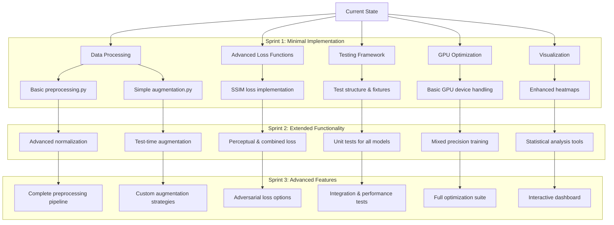

s   # Parallel Implementation Plan for Anomaly Detection System

## Implementation Strategy

This plan outlines a parallel implementation approach where we develop minimal viable versions of each remaining component simultaneously, allowing for an end-to-end functional system that can be iteratively improved.



## Sprint 1: Minimal Implementation (2-3 days)

### Data Processing

#### 1. preprocessing.py
- Basic image normalization functions
- Simple resize operations
- Grayscale conversion utilities

```python
import cv2
import numpy as np
from typing import Tuple, Optional

def normalize_image(image: np.ndarray, mean: Optional[list] = None, std: Optional[list] = None) -> np.ndarray:
    """Normalize image with given mean and std or to [0,1] range."""
    if mean is not None and std is not None:
        return (image - np.array(mean)) / np.array(std)
    return image / 255.0

def resize_image(image: np.ndarray, size: Tuple[int, int]) -> np.ndarray:
    """Resize image to target size."""
    return cv2.resize(image, size, interpolation=cv2.INTER_AREA)

def to_grayscale(image: np.ndarray) -> np.ndarray:
    """Convert image to grayscale if it has 3 channels."""
    if len(image.shape) == 3 and image.shape[2] == 3:
        return cv2.cvtColor(image, cv2.COLOR_RGB2GRAY)
    return image
```

#### 2. augmentation.py
- Horizontal and vertical flips
- Basic rotations
- Simple brightness/contrast adjustments

```python
import albumentations as A
from typing import Tuple

def get_basic_augmentations(image_size: Tuple[int, int]) -> A.Compose:
    """Get basic augmentation pipeline for training."""
    return A.Compose([
        A.HorizontalFlip(p=0.5),
        A.VerticalFlip(p=0.5),
        A.RandomRotate90(p=0.5),
        A.RandomBrightnessContrast(p=0.5),
        A.Resize(height=image_size[0], width=image_size[1]),
        A.Normalize(mean=[0.485, 0.456, 0.406], std=[0.229, 0.224, 0.225]),
    ])

def get_test_augmentations(image_size: Tuple[int, int]) -> A.Compose:
    """Get minimal test augmentations (just normalization)."""
    return A.Compose([
        A.Resize(height=image_size[0], width=image_size[1]),
        A.Normalize(mean=[0.485, 0.456, 0.406], std=[0.229, 0.224, 0.225]),
    ])
```

### Advanced Loss Functions

#### 3. losses.py
- SSIM loss implementation
- L1 loss wrapper
- MSE loss wrapper

```python
import torch
import torch.nn as nn
import torch.nn.functional as F
from typing import Optional

class SSIMloss(nn.Module):
    """Structural Similarity Index loss."""
    def __init__(self, window_size: int = 11, reduction: str = "mean"):
        super().__init__()
        self.window_size = window_size
        self.reduction = reduction
        self.channel = 1
        self.window = self._create_window(window_size)
        
    def forward(self, x: torch.Tensor, y: torch.Tensor) -> torch.Tensor:
        # SSIM implementation
        # ...
        return 1 - ssim_value  # Return loss as 1-SSIM
        
    def _create_window(self, window_size: int) -> torch.Tensor:
        # Window creation logic
        # ...
        pass

class CombinedLoss(nn.Module):
    """Combined loss with weighted components."""
    def __init__(self, 
                 mse_weight: float = 1.0,
                 l1_weight: float = 0.0,
                 ssim_weight: float = 0.0):
        super().__init__()
        self.mse_weight = mse_weight
        self.l1_weight = l1_weight
        self.ssim_weight = ssim_weight
        
        self.mse = nn.MSELoss() if mse_weight > 0 else None
        self.l1 = nn.L1Loss() if l1_weight > 0 else None
        self.ssim = SSIMloss() if ssim_weight > 0 else None
        
    def forward(self, x: torch.Tensor, y: torch.Tensor) -> torch.Tensor:
        """Calculate weighted combination of losses."""
        loss = 0.0
        
        if self.mse is not None:
            loss += self.mse_weight * self.mse(x, y)
            
        if self.l1 is not None:
            loss += self.l1_weight * self.l1(x, y)
            
        if self.ssim is not None:
            loss += self.ssim_weight * self.ssim(x, y)
            
        return loss
```

### Testing Framework

#### 4. Initial test structure
- Setup pytest configuration
- Create basic fixtures
- Implement model initialization tests

```python
# tests/conftest.py
import pytest
import torch
import numpy as np
from pathlib import Path
import yaml

@pytest.fixture
def config():
    """Load test configuration."""
    with open("anomaly_detection/config/default.yaml", "r") as f:
        return yaml.safe_load(f)
        
@pytest.fixture
def sample_image():
    """Generate a sample test image."""
    return torch.randn(1, 3, 64, 64)
    
@pytest.fixture
def device():
    """Get appropriate device."""
    return torch.device('cuda' if torch.cuda.is_available() else 'cpu')

# tests/test_models/test_base.py
import pytest
import torch
from anomaly_detection.models.base import BaseAutoencoder

def test_base_autoencoder_methods():
    """Test that base autoencoder abstract methods are defined."""
    methods = ['encode', 'decode', 'forward', 'reconstruct', 
               'calculate_reconstruction_error', 'save', 'load']
    
    for method in methods:
        assert hasattr(BaseAutoencoder, method)
```

### GPU Optimization

#### 5. Basic GPU device handling
- Device management utilities
- Memory usage monitoring
- Basic mixed precision setup

```python
# utils/device_utils.py
import torch
import psutil
import os
from typing import Union, Tuple, Dict

def get_device() -> torch.device:
    """Get the most appropriate device (CUDA or CPU)."""
    return torch.device('cuda' if torch.cuda.is_available() else 'cpu')
    
def memory_stats() -> Dict[str, float]:
    """Get memory usage statistics."""
    stats = {}
    
    # CPU memory
    process = psutil.Process(os.getpid())
    stats['cpu_memory_gb'] = process.memory_info().rss / 1e9
    
    # GPU memory if available
    if torch.cuda.is_available():
        stats['gpu_memory_allocated_gb'] = torch.cuda.memory_allocated() / 1e9
        stats['gpu_memory_reserved_gb'] = torch.cuda.memory_reserved() / 1e9
        
    return stats

def setup_mixed_precision() -> torch.cuda.amp.GradScaler:
    """Setup automatic mixed precision for training."""
    return torch.cuda.amp.GradScaler()
```

### Visualization

#### 6. Enhanced heatmaps 
- Basic anomaly heatmap generation
- Improved color mapping
- Overlay capabilities

```python
# visualization/heatmaps.py
import numpy as np
import matplotlib.pyplot as plt
import cv2
from typing import Tuple, Optional, Union

def generate_heatmap(
    error_map: np.ndarray,
    original: Optional[np.ndarray] = None,
    alpha: float = 0.5,
    colormap: str = 'jet'
) -> np.ndarray:
    """Generate a colored heatmap from error map with optional overlay."""
    # Normalize to 0-1
    error_norm = error_map / error_map.max() if error_map.max() > 0 else error_map
    
    # Apply colormap
    heatmap = plt.cm.get_cmap(colormap)(error_norm)
    heatmap = (heatmap[:, :, :3] * 255).astype(np.uint8)
    
    if original is not None:
        # Resize heatmap if needed
        if original.shape[:2] != heatmap.shape[:2]:
            heatmap = cv2.resize(heatmap, (original.shape[1], original.shape[0]))
        
        # Overlay heatmap on original image
        return cv2.addWeighted(original, 1-alpha, heatmap, alpha, 0)
    
    return heatmap
```

## Sprint 2: Extended Functionality (2-3 days)

### Data Processing
- Add more advanced normalization techniques
- Implement aspect ratio preservation
- Add test-time augmentation
- Completed PreprocessingPipeline implementation:
  * Combines normalization, resizing, grayscale conversion
  * Supports augmentation integration
  * Configurable through YAML
  * Includes comprehensive tests

### Advanced Loss Functions
- Add perceptual (VGG-based) loss
- Implement focal loss for imbalanced data
- Enhance SSIM with multi-scale options
- Add gradient penalty options

### Testing Framework
- Implement model-specific unit tests
- Add data loading tests
- Create metrics calculation tests
- Test configuration management

### GPU Optimization
- Full mixed precision training
- Implement gradient accumulation
- Add TorchScript compilation for inference
- Create ONNX export functionality

### Visualization
- Add side-by-side comparison tools
- Implement statistical analysis of anomalies
- Create basic metric visualization
- Add batch result visualization

## Sprint 3: Advanced Features (4-5 days)

### Data Processing
- Custom augmentation strategies
- Advanced preprocessing pipelines
- Multi-resolution support
- Cached preprocessing for efficiency

### Advanced Loss Functions
- Adversarial loss options
- Feature matching loss
- Custom loss scheduling
- Dynamic loss weighting

### Testing Framework
- Integration tests for full pipeline
- Performance benchmarking
- Memory profiling
- Multi-GPU testing

### GPU Optimization
- Model quantization (INT8/FP16)
- Kernel fusion optimization
- Inference throughput optimization
- Dynamic batch size determination

### Visualization
- Interactive dashboard with Streamlit
- Model comparison visualization
- Anomaly detection threshold exploration
- Export capabilities for reports

## Integration Strategy

After each sprint, all components will be integrated together to maintain a working end-to-end system. This integration will include:

1. Updating the training pipeline to use new loss functions
2. Incorporating preprocessing and augmentation into data loading
3. Running the test suite to verify system functionality
4. Profiling performance with GPU optimizations
5. Generating visualizations with the enhanced tools

This approach ensures we make balanced progress across all components while keeping the system functional at all times.